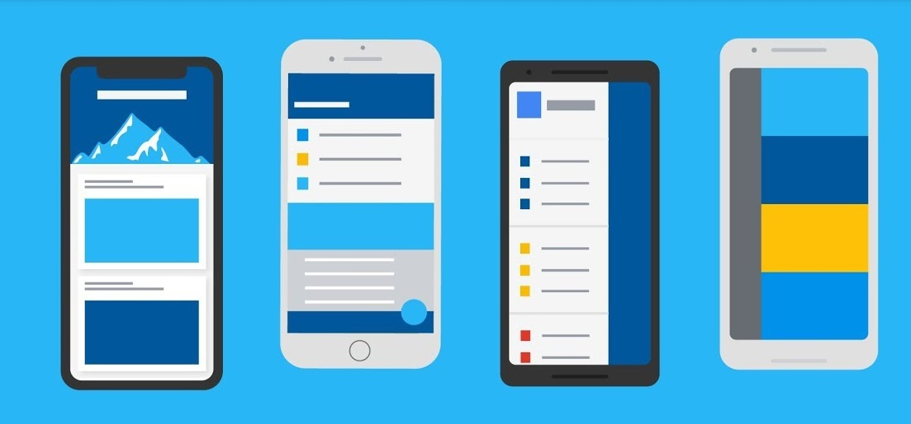

<h1 align="center">
    
</h1>

   

 

  

## 🚀 Tecnologias

Esse projeto foi desenvolvido utilizando as seguintes tecnologias:

- [Flutter](https://flutter.dev)
- [Flutter Map](https://pub.dev/packages/flutter_map)
- [SQLite](https://www.sqlite.org/index.html)

## 💻 Projeto

O Happy é um projeto que visa facilitar visitas aos orfanatos próximos a você 💜 

A ideia original foi desenvolvido na **[Next Level Week](https://nextlevelweek.com/)**, realizada pela **[@Rocketseat](https://github.com/Rocketseat)**, o presente projeto visa realizar a parte mobile do projeto orginal que era feito em **[React Native](https://reactnative.dev)**, mas realizando-a em **[Flutter](https://flutter.dev)**.

## 🔖 Layout

Você pode visualizar o layout do projeto através dos links abaixo:

- [Layout Web](https://www.figma.com/file/mDEbnoojksG4w8sOxmudh3/Happy-Web?node-id=0%3A1) 
- [Layout Mobile](https://www.figma.com/file/X27FfVxAgy9f5IFa7ONlph/Happy-Mobile?node-id=0%3A1) 

Lembrando que você precisa ter uma conta no [Figma](http://figma.com/) para acessá-lo.

## 📝 Licença

Esse projeto está sob a licença MIT. Veja o arquivo [LICENSE](LICENSE.md) para mais detalhes.

## ✍️ Lista de Afazeres
1.Confirmação do envio do formulário ao criar um orfanato.
2.Grade de fotos nas informações de um orfanato.
3.Mapa na tela de criar orfanato para selecionar localidade.

---
